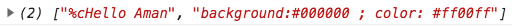

# Browser ColorLogs

A tool to help you color your browser console logs.

## Usage

### Color text

`browserLogColors.log("Hello Aman","#ff00ff");`

Outputs

### With background

`browserLogColors.log("Hello Aman","#ff00ff",'#000000');`

Outputs

### Return log string

`browserLogColors.color("Hello Aman","#ff00ff",'#000000');`

This returns an array of the different strings to output as the following:

`["%cHello Aman", "background:#000000 ; color: #ff00ff"]`

## Distribution

[Minified - https://unpkg.com/browsercolorlogs@0.0.3/dist/index.js](https://unpkg.com/browsercolorlogs@0.0.2/dist/index.js)

[Full - https://unpkg.com/browsercolorlogs@0.0.3/index.js](https://unpkg.com/browsercolorlogs@0.0.2/index.js)

## Related packages

[Colorifylog](https://www.npmjs.com/package/colorifylog) - Console log hex code colors for node

## Contributions welcome

* Make support for text shadow
* Make it happen